# Домашнее задание «Docker»

**Студент:** Демин Илья ВИткорович

---

# Задание 0. Установка Docker Compose V2

## Шаг 1. Установка Docker Compose V2

Установлен Docker Compose V2:

```bash
sudo apt update
sudo apt install docker-compose-v2
```

### Скриншот

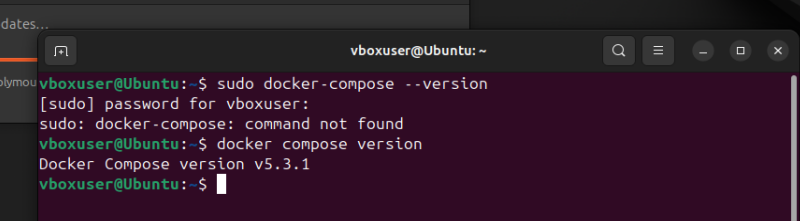

---

## Шаг 2. Проверка версии

```bash
docker compose version
```

---

# Задание 1. Создание Docker-образа

## Шаг 1. Fork репозитория

Создан fork репозитория `shvirtd-example-python`.

### Скриншот

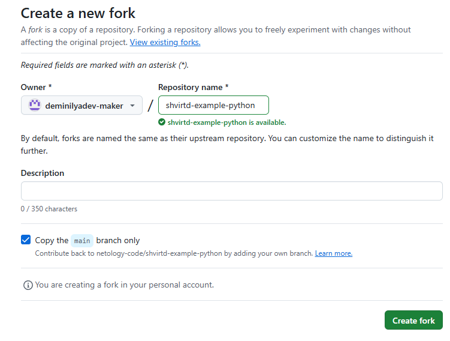

---

## Шаг 2. Создание Dockerfile

Создан файл:

```
Dockerfile.python
```

Использован официальный образ:

```
python:3.12-slim
```

Применена многоэтапная (multistage) сборка.

---

## Шаг 3. Сборка образа

```bash
docker build -f Dockerfile.python -t python-app .
```

---

## Шаг 4. Запуск контейнера

```bash
docker run --rm -p 5000:5000 python-app
```

### Скриншот

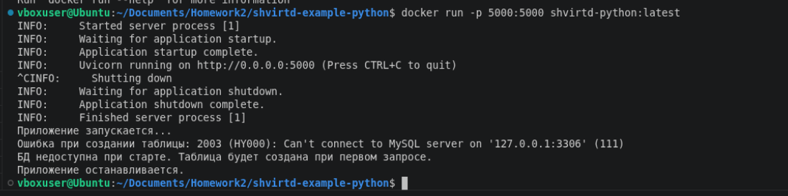

---

# Задание 2. Публикация образа

## Шаг 1. Авторизация

```bash
docker login
```

---

## Шаг 2. Публикация образа

```bash
docker push <dockerhub-user>/<image>:latest
```

---

## Шаг 3. Проверка опубликованного образа

```bash
docker pull <dockerhub-user>/<image>:latest
```

### Скриншот

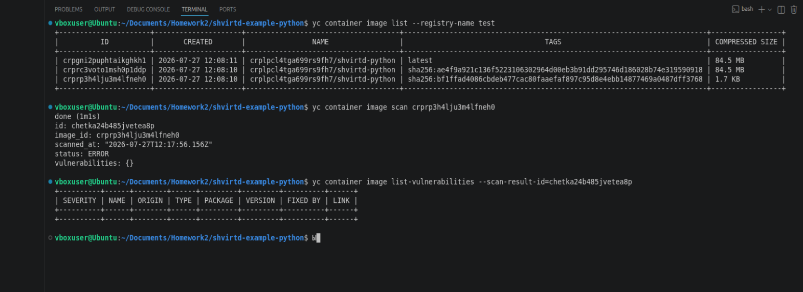

---

# Задание 3. Docker Compose

## Шаг 1. Создание compose.yaml

Создан файл:

```
compose.yaml
```

Подключён существующий файл:

```yaml
include:
  - proxy.yaml
```

---

## Шаг 2. Запуск проекта

```bash
docker compose up --build -d
```

---

## Шаг 3. Проверка приложения

```bash
curl -L http://127.0.0.1:8090
```

### Скриншот

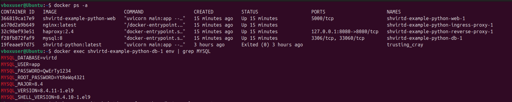

---

## Шаг 4. Подключение к MySQL

```bash
docker exec -it <container_name> mysql -u root -p
```

---

## Шаг 5. Проверка базы данных

```sql
show databases;
use virtd;
show tables;
SELECT * FROM requests LIMIT 10;
```

### Скриншот

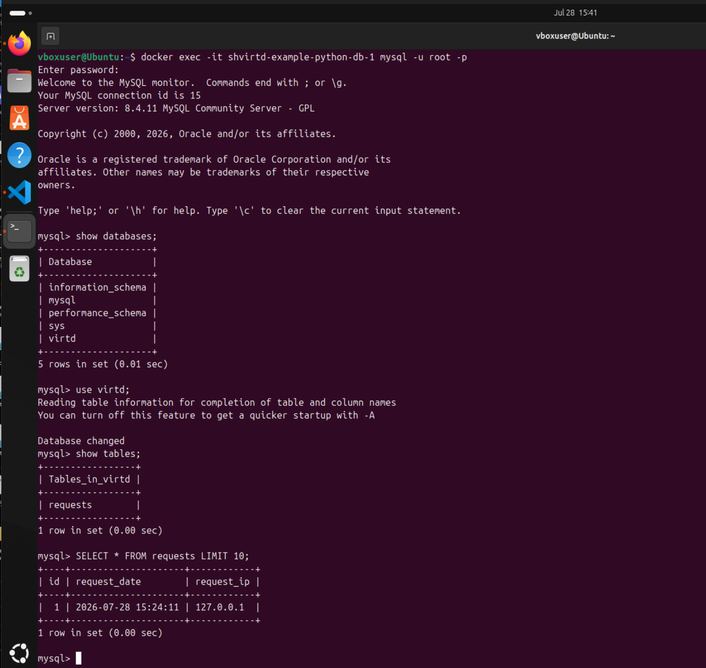

---

## Шаг 6. Остановка проекта

```bash
docker compose down
```

---

# Задание 4. Автоматизация развертывания

## Шаг 1. Создание Bash-скрипта

Создан файл:

```
deploy.sh
```

Содержимое:

```bash
#!/bin/bash

set -e

cd /opt

if [ -d "shvirtd-example-python" ]; then
    cd shvirtd-example-python
    git pull
else
    git clone https://github.com/deminilyadev-maker/shvirtd-example-python.git
    cd shvirtd-example-python
fi

docker compose up --build -d
```

### Скриншот

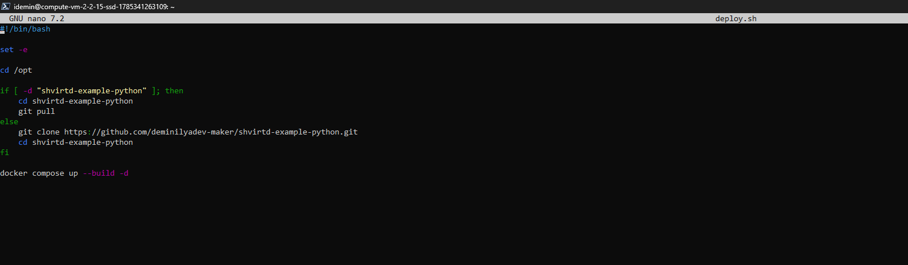

---

## Шаг 2. Назначение прав

```bash
chmod +x deploy.sh
```

---

## Шаг 3. Запуск скрипта

```bash
./deploy.sh
```

### Скриншот

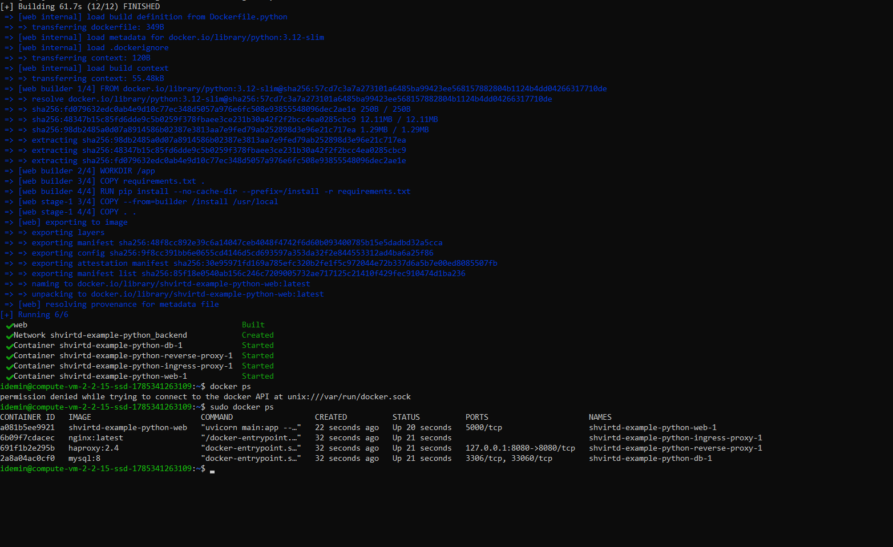

---

## Шаг 4. Проверка контейнеров

```bash
docker compose ps
```

### Скриншот

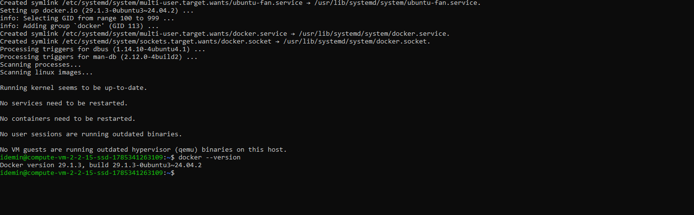

---

## Шаг 5. Проверка внешнего IP

Определение внешнего IP виртуальной машины.

### Скриншот

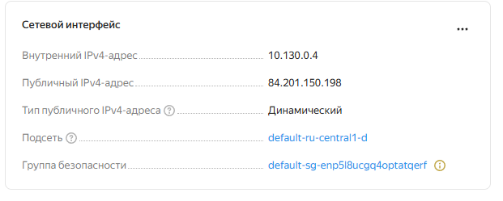

---

## Шаг 6. Проверка доступности сервиса

Проверка выполнена через сервис:

```
https://check-host.net/check-http
```

Проверяемый адрес:

```
http://84.201.150.198:8090
```

Получен ответ:

```
HTTP 200 OK
```

### Скриншот

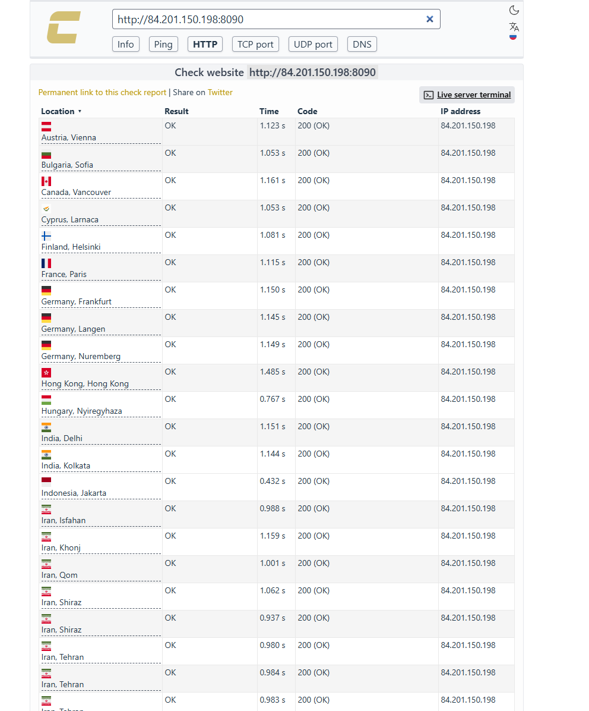

---

## Шаг 7. Проверка записей в базе данных

```bash
docker exec -it <container_name> mysql -u root -p
```

```sql
show databases;
use virtd;
show tables;
SELECT * FROM requests LIMIT 10;
```

### Скриншот

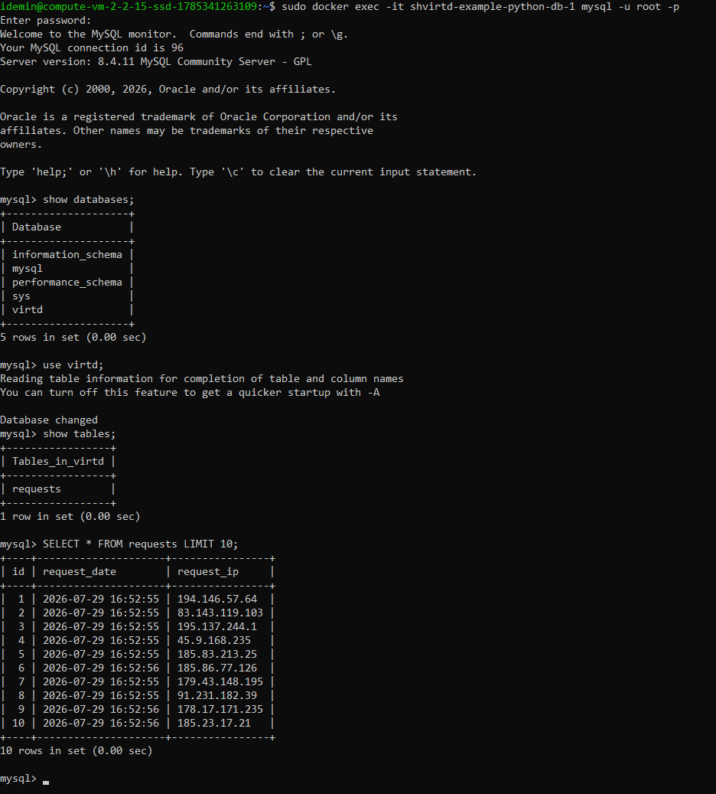

---

# Задание 6. Работа с образом Terraform

## Шаг 1. Загрузка образа

```bash
docker pull hashicorp/terraform:latest
```

---

## Шаг 2. Просмотр содержимого образа

```bash
dive hashicorp/terraform:latest
```

---

## Шаг 3. Создание контейнера

```bash
docker create --name terraform-bin hashicorp/terraform:latest
```

---

## Шаг 4. Копирование бинарного файла

```bash
docker cp terraform-bin:/bin/terraform .
```

---

## Шаг 5. Сохранение Docker-образа

```bash
docker save -o terraform.tar hashicorp/terraform:latest
```

### Скриншот

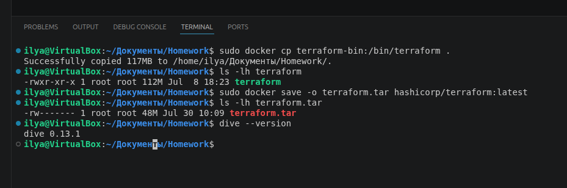
